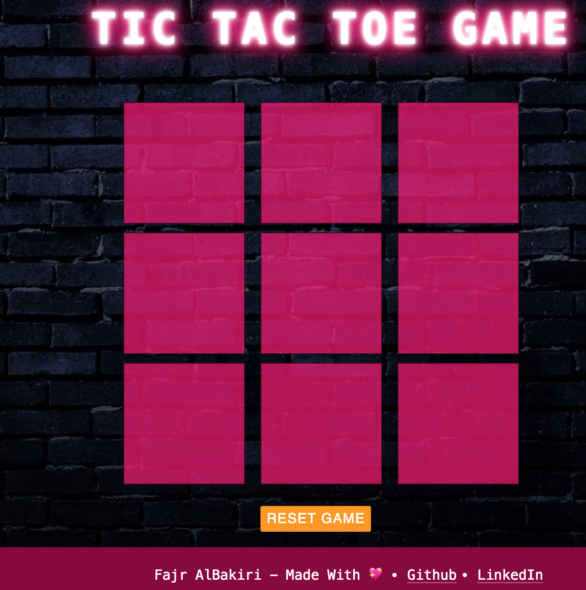
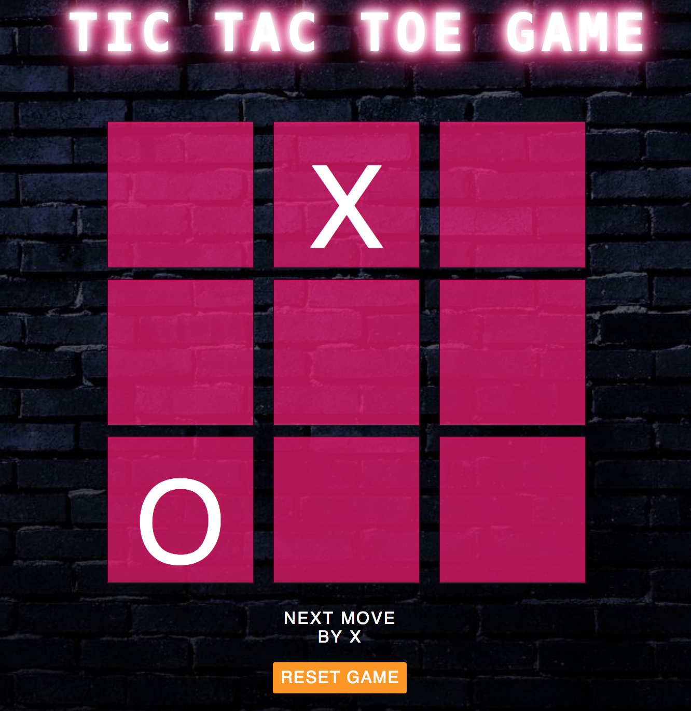
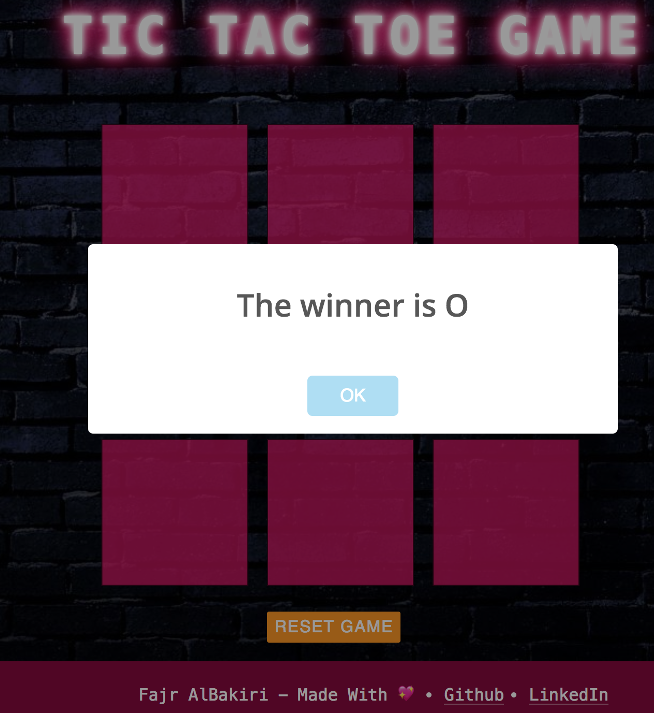

# **Tic Tac Toe**

It is a simple game developed using JavaScript, HTML and CSS. I used even and odd number to switch between X and O, x is odd and 0 is even.

**Demo Link :** https://fajrsaleh1.github.io/Project-1/landingPage.html

```
 if ($(event.target).text() === '') { 
        if(player%2 === 1){
            $(event.target).text('X');
            $(event.target).css({"color":"white", "font-size":"110px"});
            $('.whosNext').text('Next move by O');
            //to add a sound when a user click the cell
            $("<audio></audio>").attr({
                'src':'sound.wav',
                'volume':0.4,
                'autoplay':'autoplay'
            }).appendTo("body");

         }
        else {
            
           $(event.target).text('O');
           $(event.target).css({"color":"white", "font-size":"110px"});
            $('.whosNext').text('Next move by X');
            //to add a sound when a user click the cell
            $("<audio></audio>").attr({
                'src':'sound.wav',
                'volume':0.4,
                'autoplay':'autoplay'
            }).appendTo("body");
            }
            player++; 

```


# **How To Play ?**
The first player is **X** and the second player is **O**, the player who succeeds in placing three of their marks in a horizontal, vertical, or diagonal row wins the game. 





# **Favourite Part**
I enjoyed all the steps in the game, from the design until the final website, using jquery was fun and much easier than the DOM :)

# **Diffficult Part**
I love to design websites, however, CSS is not my cup of tea, and make the AI version.

# **Current Functionalities**
    1- Play with your friend ;)

# **Unsolved problems**
When I opened the website in Safari browser the layout changed and it's only work in Google Chrome browser.
MAKE THE WEBSITE RESPONSIVE 


# **Future Ideas**
    1- The user can add an avatar and the username.
    2- Play with the computer.
    3- Play with your online friends

# **Acknowledgements**
    - W3Schools
    - sweetalert
    -Felix Rilling @FelixRilling
    - Hala @hala-almaimoni
    - Majd Saleh <3 

